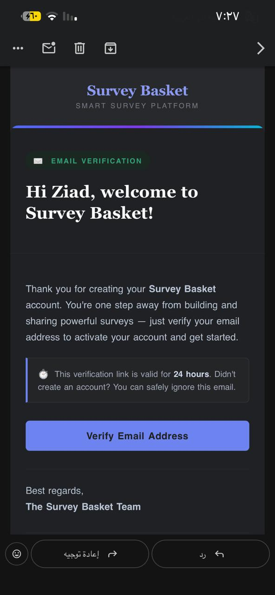
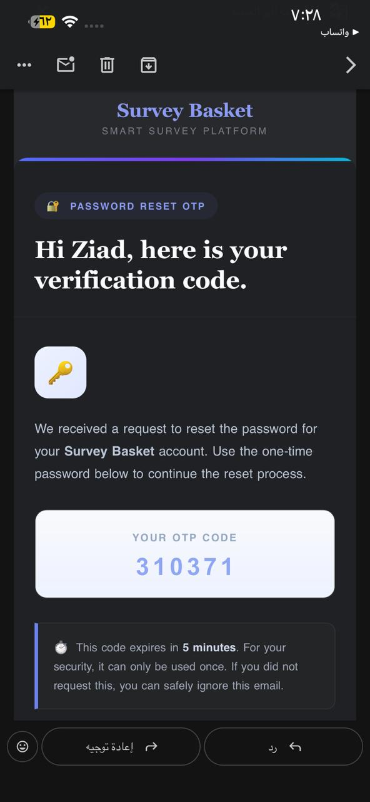
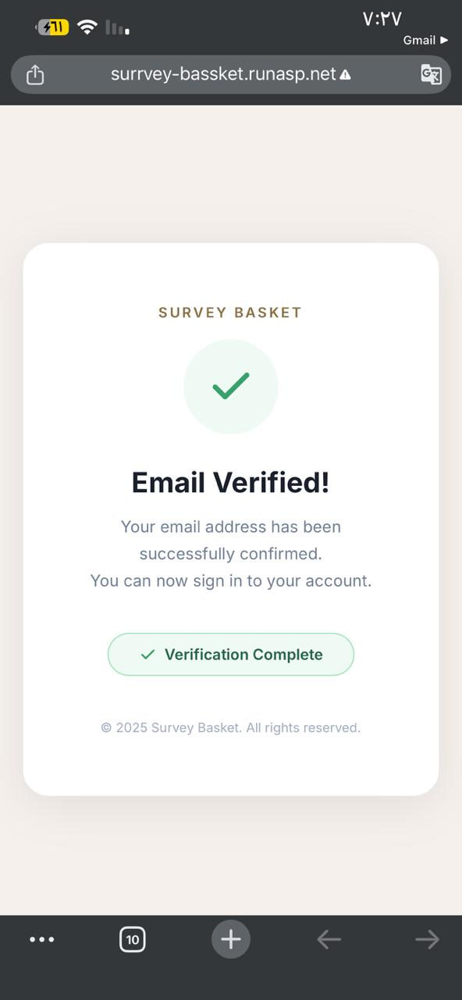
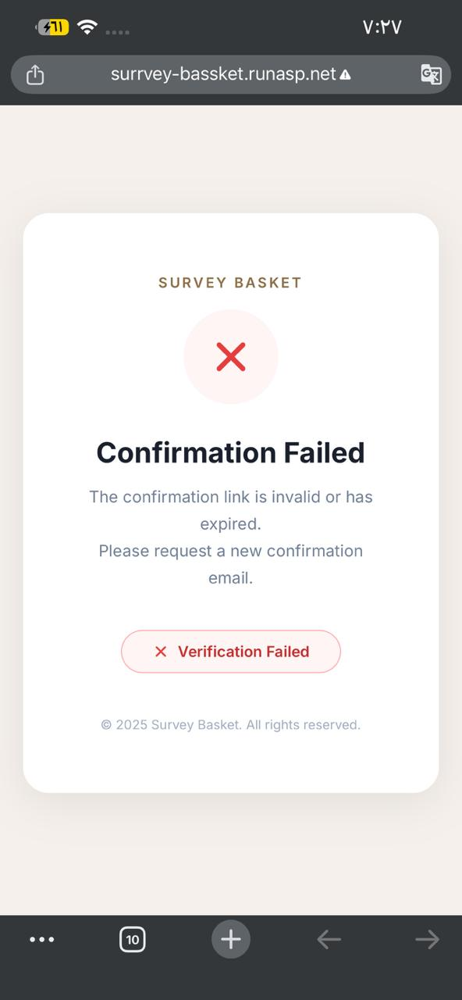

# SurveyBasket API

Production-ready RESTful API for survey management built with **ASP.NET Core 10**, **Clean Architecture**, and the **Result Pattern**.

Covers the complete survey lifecycle — poll creation, question management, voting, result analytics, JWT authentication, OTP-based password recovery, email confirmation, HybridCache, and structured logging.

---

## Live Demo

🌐 **Swagger UI** → [surrvey-bassket.runasp.net/swagger](http://surrvey-bassket.runasp.net/swagger/index.html)

---

## Key Features

- JWT Authentication with Refresh Token Rotation
- OTP-Based Password Reset with attempt limiting & cooldown
- Email Confirmation required before login
- Audit Logging — CreatedBy / UpdatedBy auto-populated
- HybridCache for active poll questions
- Result Pattern — typed errors, unified ProblemDetails responses
- Structured Logging with Serilog
- Poll Analytics — raw votes, per-day, per-question aggregations
- FluentValidation on all request models

---

## Tech Stack

| Layer | Technology |
|---|---|
| Framework | ASP.NET Core 10 Web API |
| ORM | Entity Framework Core 10 |
| Database | SQL Server |
| Authentication | ASP.NET Core Identity + JWT Bearer |
| Mapping | Mapster |
| Validation | FluentValidation |
| Logging | Serilog |
| Caching | HybridCache |
| Email | MailKit + Gmail SMTP |

---

## Architecture

```
SurveyBasket.Api/
├── Abstractions/        # Result<T>, Error, ResultExtensions
├── Authentication/      # IJwtProvider, JwtProvider, JwtOptions
├── Contracts/           # DTOs + Validators per module
├── Controllers/         # Auth, Account, Polls, Questions, Votes, Results
├── Entities/            # Poll, Question, Answer, Vote, VoteAnswer,
│                        # ApplicationUser, RefreshToken, PasswordResetOtp
├── Errors/              # Typed error definitions + GlobalExceptionHandler
├── Persistence/         # ApplicationDbContext, EF Configs, Migrations
├── Services/            # Business logic — one service per domain
├── Templates/           # HTML email templates
├── DependencyInjection.cs
└── Program.cs
```

---

## Auth Flows

### Registration & Login

```
Register → Email Confirmation sent → Confirm Email → Login → JWT + Refresh Token
```

### Refresh Token Rotation

```
Access Token expires → POST /Auth/refresh → Old token revoked → New JWT + New Refresh Token
```

### OTP Password Reset

```
Forget Password → OTP sent via Email → Verify OTP → Reset Password
```

> Resend OTP enforces a **2-minute cooldown** to prevent abuse.

---

## Email Templates

HTML templates rendered dynamically via `EmailBodyBuilder` with `{{placeholder}}` token replacement.

<table>
  <tr>
    <td width="50%" align="center">
      <b>Email Confirmation</b><br/><br/>
      
    </td>
    <td width="50%" align="center">
      <b>Forget Password (OTP)</b><br/><br/>
      
    </td>
  </tr>
  <tr>
    <td width="50%" align="center">
      <b>Confirmation Success</b><br/><br/>
      
    </td>
    <td width="50%" align="center">
      <b>Confirmation Failed</b><br/><br/>
      
    </td>
  </tr>
</table>

---

## API Reference

### Auth

| Method | Endpoint | Auth | Description |
|---|---|---|---|
| POST | `/Auth` | — | Login with email & password |
| POST | `/Auth/register` | — | Register a new account |
| GET | `/Auth/confirm-email` | — | Confirm email with token |
| POST | `/Auth/resend-confirmation-email` | — | Resend confirmation email |
| POST | `/Auth/refresh` | Bearer | Rotate access + refresh tokens |
| POST | `/Auth/revoke-refresh-token` | Bearer | Logout / revoke refresh token |
| POST | `/Auth/forget-password` | — | Send OTP reset code to email |
| POST | `/Auth/verify-otp` | — | Verify the OTP reset code |
| POST | `/Auth/reset-password` | — | Reset password with OTP code |
| POST | `/Auth/resend-otp` | — | Resend OTP (2-min cooldown) |

### Account

| Method | Endpoint | Auth | Description |
|---|---|---|---|
| GET | `/Account/profile` | Bearer | Get current user profile |
| PUT | `/Account/update-profile` | Bearer | Update first & last name |
| PUT | `/Account/change-password` | Bearer | Change account password |

### Polls

| Method | Endpoint | Auth | Description |
|---|---|---|---|
| GET | `/api/Polls` | Bearer | Get all polls |
| GET | `/api/Polls/current` | Bearer | Get active published polls |
| GET | `/api/Polls/{id}` | Bearer | Get poll by ID |
| POST | `/api/Polls` | Bearer | Create new poll |
| PUT | `/api/Polls/{id}` | Bearer | Update poll |
| DELETE | `/api/Polls/{id}` | Bearer | Delete poll |
| PUT | `/api/Polls/{id}/togglePublish` | Bearer | Toggle publish status |

### Questions

| Method | Endpoint | Auth | Description |
|---|---|---|---|
| GET | `/api/polls/{pollId}/Questions` | Bearer | Get all questions for a poll |
| GET | `/api/polls/{pollId}/Questions/{id}` | Bearer | Get question by ID |
| POST | `/api/polls/{pollId}/Questions` | Bearer | Add question with answers |
| PUT | `/api/polls/{pollId}/Questions/{id}` | Bearer | Update question & answers |
| PUT | `/api/polls/{pollId}/Questions/{id}/toggleStatus` | Bearer | Toggle question active status |

### Votes

| Method | Endpoint | Auth | Description |
|---|---|---|---|
| GET | `/api/polls/{pollId}/vote` | Bearer | Get available questions for voting |
| POST | `/api/polls/{pollId}/vote` | Bearer | Submit vote answers |

### Results

| Method | Endpoint | Auth | Description |
|---|---|---|---|
| GET | `/api/polls/{pollId}/Results/raw-data` | Bearer | All votes with voter names & answers |
| GET | `/api/polls/{pollId}/Results/votes-per-day` | Bearer | Daily vote count aggregation |
| GET | `/api/polls/{pollId}/Results/votes-per-question` | Bearer | Per-question answer distribution |

---

## Getting Started

**Prerequisites:** .NET 10 SDK · SQL Server

```bash
git clone https://github.com/a7medhazem/SurveyBasket.git
cd SurveyBasket
dotnet ef database update --project SurveyBasket.Api
dotnet run --project SurveyBasket.Api
```

Configure `appsettings.json`:

```json
{
  "ConnectionStrings": {
    "DefaultConnection": "Server=.;Database=SurveyBasket;Trusted_Connection=True;Encrypt=False"
  },
  "Jwt": {
    "Key": "your-secret-key-min-32-chars",
    "Issuer": "SurveyBasketApp",
    "Audience": "SurveyBasketApp users",
    "ExpiryMinutes": 30
  },
  "EmailSettings": {
    "Mail": "your@gmail.com",
    "DisplayName": "Survey Basket",
    "Password": "your-app-password",
    "Host": "smtp.gmail.com",
    "Port": 587
  },
  "AppSettings": {
    "BaseUrl": "https://your-domain.com"
  }
}
```

Swagger: `https://localhost:{port}/swagger`

---

## Author

**Ahmed Hazem** — Backend .NET Developer

[](https://github.com/a7medhazem)
[](https://linkedin.com/in/ahmed-hazzem)

---

## License

Licensed under the [MIT License](https://github.com/a7medhazem/SurveyBasket/tree/master?tab=MIT-1-ov-file).